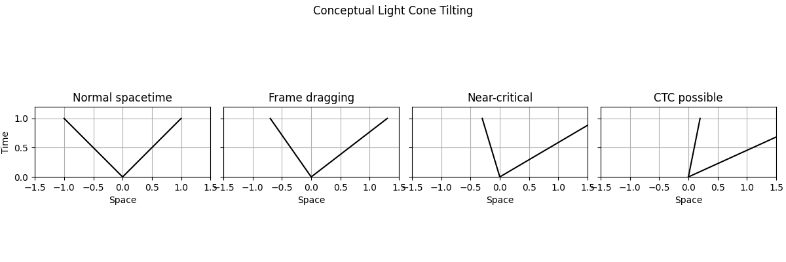
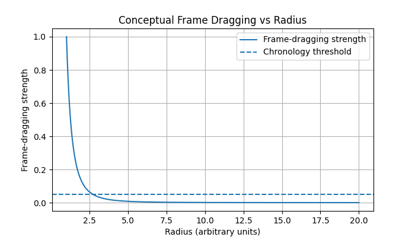
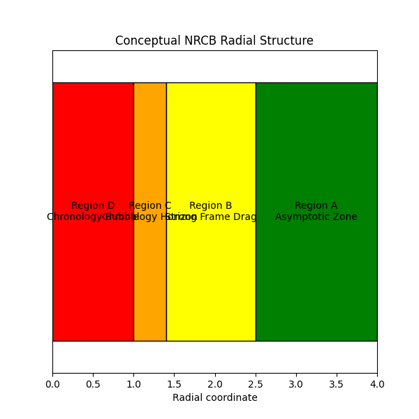
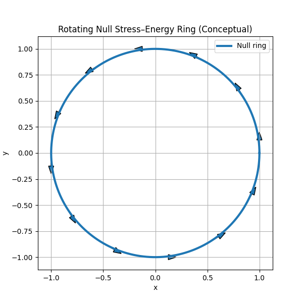

# Toy Model Visualizations

This document provides an overview of the four conceptual Python toy models included in the repository.  
These visualizations **do not** solve Einstein’s equations. They are pedagogical illustrations designed to help readers understand the geometric and causal ideas behind the NRCB model.

All images referenced here can be found in the `results/` folder.

---

## 1. Light Cone Tilting

**File:** `notebooks/01_light_cone_tilting.py`  
**Image:** `results/toy1_light_cone_tilting.png`

This visualization shows:

- Normal spacetime → upright light cones  
- Increasing rotation → light cones tilt  
- Critical frame dragging → cones align horizontally  
- Beyond critical → closed timelike curves (CTCs) become possible  

This is a **conceptual metaphor** for how extreme rotation can twist causal structure in GR-like spacetimes.

---

## 2. Frame Dragging Strength vs Radius

**File:** `notebooks/02_frame_drag_profile.py`  
**Image:** `results/toy2_frame_drag_profile.png`

This plot demonstrates:

- Frame dragging increases dramatically closer to the compact source  
- A hypothetical “chronology threshold” where tilting becomes critical  
- Why any exotic behavior must be deeply buried and extremely localized  

The curve is not calculated from GR — it is a conceptual profile.

---

## 3. NRCB Radial Region Map (A–D)

**File:** `notebooks/03_region_map.py`  
**Image:** `results/toy3_region_map.png`

This diagram illustrates the **four conceptual regions** of the NRCB interior:

- **Region A:** Asymptotic zone  
- **Region B:** Strong frame-dragging zone  
- **Region C:** Chronology horizon  
- **Region D:** Localized time-loop (CTC) bubble  

This helps show the spatial logic used throughout the theoretical model.

---

## 4. Rotating Null Ring Visualization

**File:** `notebooks/04_null_ring_visualization.py`  
**Image:** `results/toy4_null_ring_visualization.png`

This visualization shows the **rotating null (lightlike) ring** conceptually used as the internal gravitational source for the exotic region:

- The ring carries the total angular momentum  
- Arrows indicate rotation  
- The ring is symbolic, not literal physics  

This image exists purely to illustrate the interior geometry concept.

---

## Purpose of These Models

These visualizations serve to:

- Provide intuitive anchors for abstract spacetime concepts  
- Demonstrate the geometry, not the equations  
- Make the NRCB framework easier to understand at a glance  
- Keep the project grounded and visually interpretable  

They are not simulations — and they are intentionally simple.

---

## Next Steps (Optional)

If desired, additional conceptual toys could illustrate:

- A Kerr-like frame dragging field
- Photon orbit geometry
- Time dilation gradients
- Light ray bending around a compact object

These are optional additions, but the current four are sufficient for a complete conceptual stack.

---

## Summary

These toy models complement the NRCB theoretical documents by giving readers a visual sense of:

- causal tilting,  
- frame-dragging buildup,  
- radial region structure,  
- and the null ring source.  

They are simple, honest, and scientifically safe visual aids — exactly what belongs in a conceptual GR repo.
